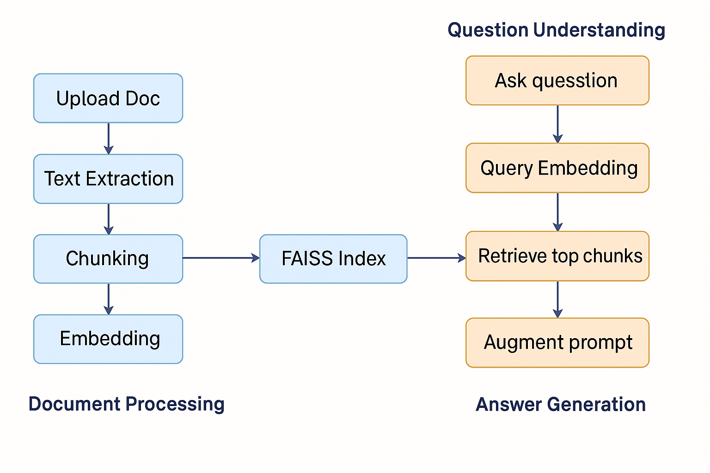

#  Theory – Retrieval-Augmented Generation (RAG) Chatbot with Document Upload

---

##  1. Introduction

Large Language Models (LLMs), like GPT-3.5, are powerful but have two main limitations:
1. **Knowledge Cutoff:** They only know what they were trained on.
2. **Context Limit:** They can only handle a limited number of tokens in a prompt.

**Retrieval-Augmented Generation (RAG)** solves these problems by:
- Allowing the model to **retrieve information dynamically** from uploaded documents.
- Providing this **context to the LLM**, improving accuracy and grounding answers in real data.

---

##  2. RAG Pipeline Overview

Here's how a **document-based RAG chatbot** works:
```
User uploads doc → Text Extraction → Chunking → Embedding → FAISS Index
↓
User asks question → Query Embedding → Retrieve top chunks → Augment prompt
↓
LLM generates answer based on retrieved context
```

---

##  3. Step-by-Step Explanation

### 3.1 Document Loading
- **Goal:** Extract text from `.txt` or `.pdf`.
- `.txt` → Simple read operation.
- `.pdf` → Uses **PyMuPDF** to extract readable text.

If a PDF is **scanned or image-based**, OCR (Optical Character Recognition) is needed.

---

### 3.2 Chunking

**Problem:**  
LLMs can't process entire books or long documents directly (GPT-3.5 max ~16,000 tokens).  
If you send all text → prompt too big → errors or ignored content.

**Solution:**  
Split text into **chunks**.

####  How we chunk:
- Split into **fixed-size slices** (e.g., 300–500 characters or tokens).
- Add **overlap (50 characters)** to preserve context between chunks.

Example:
```
Text = "This is a long document about AI and its applications..."
Chunk 1 = words[0:300]
Chunk 2 = words[250:550]
Chunk 3 = words[500:800]
...
```
**Why overlap?**  
Avoids breaking important sentences between chunks, improving retrieval accuracy.

---

### 3.3 Embeddings

**Definition:**  
An **embedding** is a numerical vector (list of numbers) representing text meaning in a high-dimensional space.

- Example:
    - "Dog" → `[0.1, 0.7, 0.5, ...]`
    - "Cat" → `[0.12, 0.69, 0.52, ...]`
    - "Car" → `[0.9, 0.1, 0.3, ...]`
- Similar text = similar vectors (closer in space).

We use:
- **Model:** `all-MiniLM-L6-v2` (384-dimensional vector).
- Library: **SentenceTransformers**.

---

### 3.4 Vector Database (FAISS)

**Problem:** How do we quickly search through thousands of chunks for the most relevant ones?

**Solution:**  
We store all embeddings in **FAISS** (Facebook AI Similarity Search):
- Specialized database for **fast similarity search**.
- Uses **cosine similarity** or **L2 distance** to find closest matches.

Example:
```
Query: "What is AI?"
FAISS finds chunks with embeddings closest to query embedding:
- "AI stands for Artificial Intelligence..."
- "Applications of AI include..."
```

This reduces the search problem from "read entire doc" to "find top-3 relevant chunks in <1ms>".

---

### 3.5 Retrieval

Steps:
1. Convert user **question** → embedding.
2. Search FAISS for **k=3** closest chunks.
3. Combine retrieved chunks: 
- Context: Chunk 1 - Chunk 2 - Chunk 3

---

### 3.6 Prompt Augmentation

We **inject retrieved text into the LLM prompt**, guiding GPT-3.5 to base its answer only on document content:
```
You are a helpful assistant. Use ONLY the context below to answer.
If not found, say "Not found in document."

Context:
<retrieved chunks>

Question: <user query>
Answer:
```
This reduces **hallucinations** and ensures answers are relevant.

---

### 3.7 Generation

Finally, GPT-3.5 processes:
- **Query** + **Retrieved Context**
- Generates a **factual, document-grounded answer**.

Example:
```
Question: "What skills are mentioned in the document?"
Context: "The document mentions leadership, data analysis, and teamwork skills."
Answer: "The document lists leadership, data analysis, and teamwork as key skills."
```
---

##  4. Key Parameters to Tune

1. **Chunk size** → Smaller chunks improve precision but can lose context.
2. **Overlap** → Avoids context loss between chunks.
3. **Top_k retrieval** → Usually 3–5 chunks.
4. **Embedding model** → Higher-dimensional models improve matching.

---

##  5. Common Issues

- **Empty retrieval:**  
    - Document text not extracted properly (e.g., scanned PDFs).  
    - Chunk size too large → only one big chunk.
- **Irrelevant answers:**  
    - Embeddings model mismatch.  
    - Poor chunk splitting or wrong query wording.
- **No context usage:**  
    - LLM prompt not strong enough.  
    - Retrieved context too vague.

---

##  6. Why RAG Matters

- Avoids retraining LLMs for every new document.
- Dynamically adds **private or updated knowledge**.
- Reduces hallucinations → **more trustworthy AI**.

---

## 7. RAG Architecture Diagram



*(If diagram doesn't load, ensure the `assets/` folder has the PNG file.)*

---

##  8. Next Step

- Add **Memory** to enable multi-turn conversations:
  - Store chat history.
  - Pass last N messages + retrieved context to GPT.
- Add **Multiple Document Support** (create knowledge base from multiple PDFs).

---